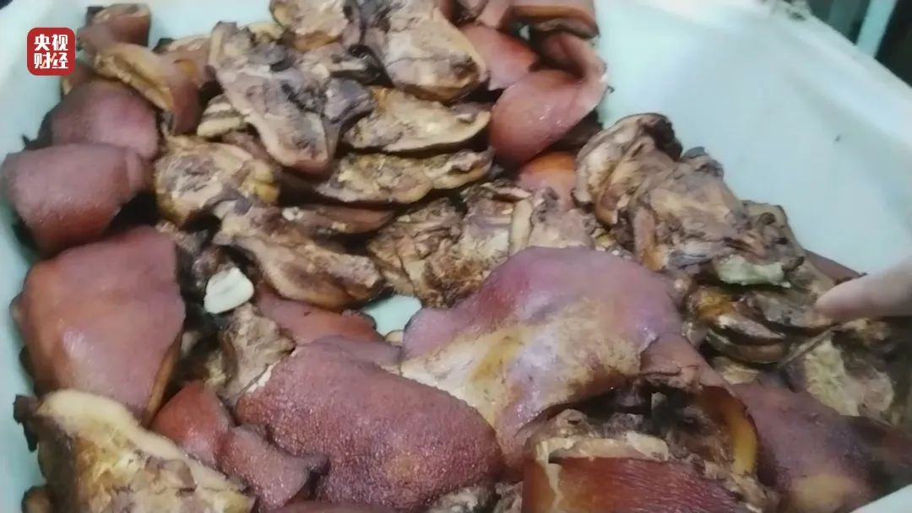

# 主页面

| 曝光时间       | 产品名             | 涉事公司                                                  | 备注                                                                                                                                                                                                                                                 |                     |
|------------|-----------------|-------------------------------------------------------|----------------------------------------------------------------------------------------------------------------------------------------------------------------------------------------------------------------------------------------------------|---------------------|
| 2025年3月15日 | 啄木鸟家庭维修         | 重庆啄木鸟网络科技有限公司                                         | 小病大修，没病乱修                                                                                                                                                                                                                                          |
| 2025年3月15日 | 一次性内裤           | 商丘市健芝初医疗器械有限公司、浪莎、初医生、贝姿妍                             | 在生产环节不灭菌、徒手制作等问题。该工厂为浪莎代工生产的一次性内裤未按标准进行消毒，部分产品甚至使用涤纶冒充纯棉材质。                                                                                                                                                                                        |
| 2025年3月15日 | 翻新卫生巾           | 梁山希希纸制品有限公司                                           | 麦酷酷、自由点、嫚熙、中亿孕婴、好之、米菲、babycare、全棉时代、苏菲等                                                                                                                                                                                                            |
| 2025年3月15日 | 纸尿裤             |                                                       |                                                                                                                                                                                                                                                    |                     |   |
| 2025年3月15日 | 增重的虾仁           | 尚方舟食品、中青海洋水产、湛江良基食品、连云港鲜知肴食品、渔趣多食品、宝辉水产、良基冷冻食品        | 多家水产企业违规生产“保水虾仁”，揭露行业乱象，调查发现，部分企业为增重牟利，在虾仁加工中超量添加保水剂（**复合磷酸盐**），并刻意隐瞒添加信息。国家标准规定冷冻虾仁磷酸盐添加量不得超过5克/千克，但检测显示宝辉水产产品超标51.4%，良基冷冻产品更超标145%。涉事企业通过浸泡保水剂使虾仁增重20%以上，并二次包冰衣进一步增重，导致消费者实际购买1斤虾仁含冰近7两。这些企业不仅在加工环节违规，还存在标签欺诈行为，成品包装仅标注“虾仁和水”，刻意隐瞒保水剂添加事实，误导消费者。 |                     | |
| 2025年3月15日 | 电子签、高利贷         | 借宝科技有限公司、人人信科技有限公司 、借贷宝、人人信                           | 多家水产企业违规生产“保水虾仁”，揭露行业乱象，调查发现，部分企业为增重牟利，在虾仁加工中超量添加保水剂（**复合磷酸盐**），并刻意隐瞒添加信息。国家标准规定冷冻虾仁磷酸盐添加量不得超过5克/千克，但检测显示宝辉水产产品超标51.4%，良基冷冻产品更超标145%。涉事企业通过浸泡保水剂使虾仁增重20%以上，并二次包冰衣进一步增重，导致消费者实际购买1斤虾仁含冰近7两。这些企业不仅在加工环节违规，还存在标签欺诈行为，成品包装仅标注“虾仁和水”，刻意隐瞒保水剂添加事实，误导消费者。 |                     | |
| 2025年3月15日 | 非标的电线电缆         | 科德国际五金市场、金明阳电线电缆公司、润雄电缆集团有限公司                         | 多家水产企业违规生产“保水虾仁”，揭露行业乱象，调查发现，部分企业为增重牟利，在虾仁加工中超量添加保水剂（**复合磷酸盐**），并刻意隐瞒添加信息。国家标准规定冷冻虾仁磷酸盐添加量不得超过5克/千克，但检测显示宝辉水产产品超标51.4%，良基冷冻产品更超标145%。涉事企业通过浸泡保水剂使虾仁增重20%以上，并二次包冰衣进一步增重，导致消费者实际购买1斤虾仁含冰近7两。这些企业不仅在加工环节违规，还存在标签欺诈行为，成品包装仅标注“虾仁和水”，刻意隐瞒保水剂添加事实，误导消费者。 |                     | |
| 2024年3月15日 | 梅菜扣肉            | 阜阳市春天食品有限公司、安徽东辉食品科技有限公司                              | 使用未经严格处理的劣质槽头肉（含大量淋巴结、脂肪瘤）作为原料，存在食品安全隐患‌                                                                                                                                                                                                           |  | |
| 2024年3月15日 | 珍爱网、百合网世纪佳缘、恋爱课 | 深圳市珍爱网信息技术、上海花千树信息科技、百合佳缘网络集团                         | 欺诈、诱惑消费                                                                                                                                                                                                                                            |                     | |
| 2024年3月15日 | 主板机黑灰产业链        | 云机侠（深圳）科技有限公司                                         | 生产主板机设备，通过虚假广告宣称可操控网络投票、游戏等，存在网络黑灰产业链风险‌                                                                                                                                                                                                           |                     | |
| 2024年3月15日 | ‌防火玻璃造假         | 天津、河北部分防火玻璃生产企业                                       | 生产未达国家标准的防火玻璃，伪造检测报告，实际耐火性能远低于宣称标准（如耐火仅30分钟，远低于1小时要求                                                                                                                                                                                               |                     | |
| 2024年3月15日 | ‌非标灭火器          | 湖南株洲闽湘消防设备有限公司                                        | 销售磷酸二氢铵含量不足的非标灭火器（部分仅含20%有效成分），甚至宣称“越灭火越大”‌                                                                                                                                                                                                        |                     | |
| 2023年3月15日 | ‌香精勾兑的泰国香米      | 安徽香王粮油食品科技‌、‌寿县永良粮油食品（永良米业）‌、‌淮南市楚丰工贸‌、上海朗枫香料‌、上海枫米实业 | 使用普通大米添加香精冒充“泰国茉莉香米”，年销量超1000吨，香精生产环境恶劣、原料成分不明‌                                                                                                                                                                                                    |                     | |
| 2023年3月15日 | ‌劣质电动自行车头盔      | 广东中山部分头盔生产厂家‌、‌广州白云区某头盔批发商‌、‌深圳某电商平台关联企业,具体不明，都是广东省一带 | 使用回收料等劣质材料生产头盔，碰撞后易破碎扎伤使用者，安全性能严重不达标‌                                                                                                                                                                                                              |                     | |
| 2023年3月15日 | ‌妆字号美容针         | 海茂生物科技‌、广州暨肽因子医疗生物科技、广州依圣姿生物医药、旭日美业商贸、遇太美生物科技、易圣生物科技  | 将“妆字号”化妆品违规用于面部注射，导致消费者皮肤溃烂、面部变形，部分产品无备案且利润高达10倍‌                                                                                                                                                                                                  |                     | |
| 2023年3月15日 | ‌直播间“苦情戏”骗局     | 多个直播账号（如“小张说事”“马洪亮”等）                                 | 编造情感故事诱导老年人购买“神药”，实际为普通食品或假冒产品‌                                                                                                                                                                                                                    |                     | |
| 2023年3月15日 | ‌免费评书机暗藏卖药陷阱‌	  | 深圳市琪艾美电子有限公司                                          | 通过免费赠送评书机向老年人推销高价保健品，虚构药品疗效‌                                                                                                                                                                                                                       |                     | |
| 2023年3月15日 | ‌网络水军操控舆论	      | 嘉兴宇禾文化传媒有限公司、延安亚润进网络科技有限公司                            | 利用群控系统、虚拟手机号批量注册账号，为直播间刷人气、伪造商品好评‌                                                                                                                                                                                                                 |                     | |
| 2023年3月15日 | ‌翻新绝缘子流向电力工程	   | 河北庆荣电力器材有限公司、沧州明发电力电器有限公司等                            | 将旧绝缘子简单翻新后冒充合格品销售，埋下电网安全隐患‌                                                                                                                                                                                                                        |                     | |
| 2023年3月15日 | ‌破解版APP窃取个人信息	  | 多个破解版APP（如“优酷”“爱奇艺”等）                                 | 植入SDK恶意程序非法采集用户设备信息并上传至境外服务器‌                                                                                                                                                                                                                      |                     | |
| 2023年3月15日 | ‌高标准农田建设漏洞      | 江苏盐城滨海县高标准农田项目                                        | 施工中使用非标水泥管，钢筋裸露、裂缝严重，偷工减料影响工程质量‌                                                                                                                                                                                                                   |                     | |
| 2022年3月15日 | ‌女主播背后的秘密       | 哈尔滨聚享互娱传媒、沈阳亿泰、华亿播商贸                                  | 男运营冒充女主播，通过私信聊天、添加微信等方式诱导粉丝打赏，并利用“PK连线”刺激消费‌。操控粉丝，虚构主播身份及情感关系‌                                                                                                                                                                                     |                     | |
| 2022年3月15日 | ‌翡翠直播骗局         | 永德祥玉器店、 承泽珠宝、腾冲市罗旺珠宝行                                 | 编造主播专业身份，虚标价格。伪造“缅甸矿区砍价”场景，用廉价成品冒充高价原石‌                                                                                                                                                                                                            |                     | |
